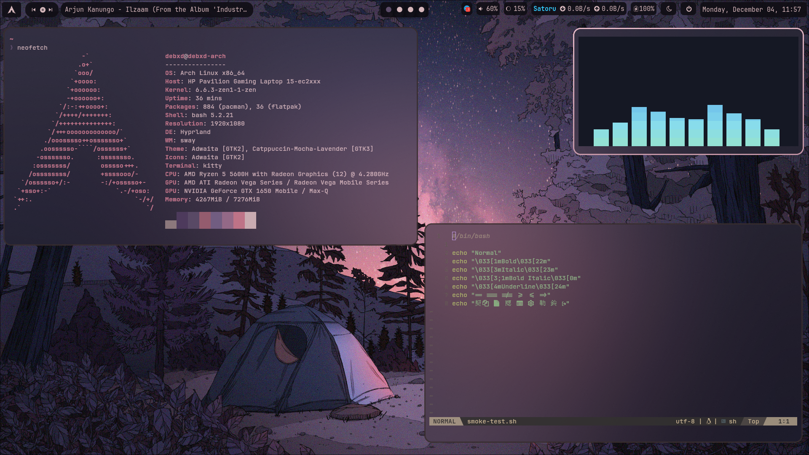

#### config files that are used to customize/rice linux as per my workflow and liking

## Dependencies:
### For Hyprland : 
    `yay -S gtk3 hyprshot hyprpaper hyprland kitty brightnessctl 
    pipewire-pulse pipewire rofi cava-git swayidle swaylock 
    hyprpicker pavucontrol xdg-desktop-portal-hyprland swaync 
    sof-firmware gnome-keyring xclip`

    * Note : you must have yay installed beforehand

## Showcase :
### i3

  

### Hyprland

  

